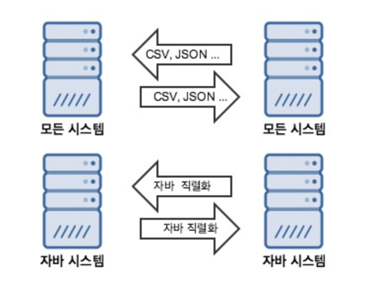

#직렬화
>객체 직렬화는 객체의 상태를 일련의 바이트로 저장하는 프로세스와 미래의 어느 시점에 
> 이러한 바이트를 라이브 객체로 다시 작성하는 프로세스입니다.

## 어디에 사용할까?
- 객체의 상태를 영속해야 할 필요가 있을때 
- **다른 VM 에게 객체의 정보를 보내줘야 할 때, 바이트 스트림으로 변환하여 전송**.

##메커니즘 
1. The Default Mechanism.
2. NonSerializable Mechanism.
3. Custom Serializable Mechanism.

## 실무 조언
1. serialVersionUID는 개발 시 직접 관리 (해당 객체 내용 바뀔 경우 Read 과정에서 예외 발생 가능하기 때문에.)
2. 역직렬화 대상 클래스의 멤버 변수 타입변경 지양
3. 외부(DB, 캐시 서버, NoSQL 서버 등)에 장기간 저장될 정보는 Java 직렬화 사용 지양 (클래스 변경을 예측할 수 없으므로)
4. 개발자가 직접 컨트롤할 수 없는 클래스(프레임워크 또는 라이브러리에서 제공하는 클래스)는 직렬화 지양
5. 자주 변경되는 클래스는 Java 직렬화를 사용하지 않는 것이 좋다.
6.역직렬화에 실패하는 상황에 대한 예외처리 필수
7.직렬화된 데이터는 타입 정보등의 클래스 메타정보를 포함하기 때문에 JSON 포맷에 비해 약 2~10배 더 사이즈가 크다. 
6. 특히 직렬화된 데이터를 메모리 서버(Redis, Memcached)에 저장하는 환경에서 트래픽에 따라 네트워크 비용과 캐시 서버 비용이 급증할 수 있으므로, JSON 포맷으로의 변경을 고려해야 한다.

1.외부 저장소로 저장되는 데이터는 짧은 만료시간의 데이터를 제외하고 자바 직렬화를 사용을 지양합니다.
2.역직렬화시 반드시 예외가 생긴다는 것을 생각하고 개발합니다.
3.자주 변경되는 비즈니스적인 데이터를 자바 직렬화을 사용하지 않습니다.
4.긴 만료 시간을 가지는 데이터는 JSON 등 다른 포맷을 사용하여 저장합니다.

>외부(DB, 캐시 서버, NoSQL 서버 등)에 장기간 저장될 정보는 자바 직렬화 사용을 지양해야 합니다.
역직렬화 대상의 클래스가 언제 변경이 일어날지 모르는 환경에서 긴 시간 동안 외부에 존재했던 직렬화된 데이터는 쓰레기(Garbage)가 될 가능성이 높습니다.
언제 예외가 발생할지 모르는 지뢰 시스템이 될 수도 있습니다.

##장점
>자바 직렬화는 자바 시스템에서 개발에 최적화되어 있습니다.
> 
>복잡한 데이터 구조의 클래스의 객체라도 직렬화 기본 조건만 지키면 큰 작업 없이 바로 직렬화를 가능합니다. 물론 역직렬화도 마찬가지입니다.
> 
>당연하게 보이는 장점 중에 하나지만 데이터 타입이 자동으로 맞춰지기 때문에 관련 부분을 큰 신경을 쓰지 않아도 됩니다.
그렇게 역직렬화가 되면 기존 객체처럼 바로 사용할 수 있게 됩니다. 
> 
##사용 
1. 캐시 (Cache)
>자바 시스템에서 퍼포먼스를 위해 캐시(Ehcache, Redis, Memcached, …)
라이브러리를 시스템을 많이 이용하게 됩니다.
2. 서블릿 세션 (Servlet Session)
> WAS(톰캣, 웹로직 등)들은 대부분 세션의 자바 직렬화를 지원
> 
>파일로 저장하거나 세션 클러스터링, DB를 저장하는 옵션 등을 선택하게 되면 세션 자체가 직렬화가 되어 저장되어 전달됩니다.

##Redis 와 직렬화

>용량 문제는 생각보다 많은 곳에서 나타나는 문제입니다. 특히 직렬화된 데이터를 메모리 서버(Redis, Memcached)에 저장하는 형태를 가진 시스템에서 두드러집니다.
메모리 서버 특성상 메모리 용량이 크지 않기 때문에 핵심만 요약해서 기록하는 형태가 효율적입니다.
적은 데이터만 입력하는 시스템 구조라면 큰 문제는 발생하지 않습니다. 하지만 트래픽에 따라 데이터 기록이 급증하는 시스템은 유의해야 합니다.

>그리고 이 부분을 강조하는 이유는 자바 웹 시스템에서 가장 많이 사용되는 스프링 프레임워크에서 기본적으로 지원하는 캐시 모듈 중
외부 시스템에 저장하는 형태에서 기본적으로 자바 직렬화 형태로 제공되기 때문입니다. (Spring Data Redis, Spring Session …)
기본적으로 프레임워크에서 자바 직렬화로 제공하는 이유는 앞서 말한 자바 직렬화 장점과 일맥상통합니다. 개발자가 신경 안 쓰고 빠르게 개발할 수 있기 때문입니다.
자바 직렬화 사용하는 시스템은 규모가 커지는 시점에서 반드시 다시 점검하여 보시길 바랍니다.

[참조]https://techblog.woowahan.com/2551/
